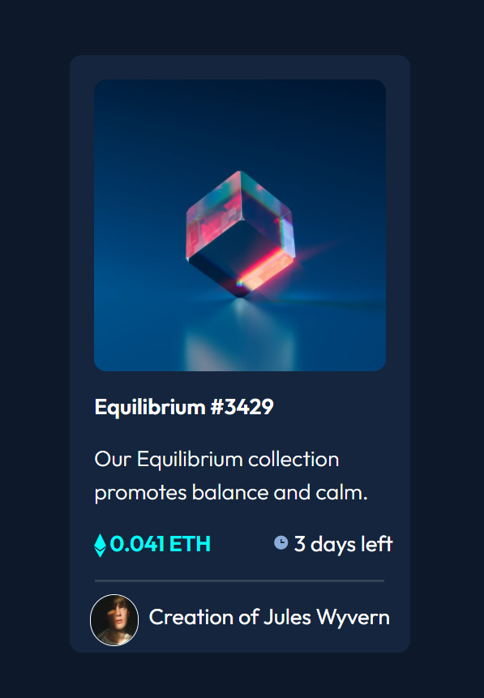

# Frontend Mentor - NFT preview card component solution

This is a solution to the [NFT preview card component challenge on Frontend Mentor](https://www.frontendmentor.io/challenges/nft-preview-card-component-SbdUL_w0U). Frontend Mentor challenges help you improve your coding skills by building realistic projects.

## Table of contents

- [Overview](#overview)
  - [The challenge](#the-challenge)
  - [Screenshot](#screenshot)
  - [Links](#links)
- [My process](#my-process)
  - [Built with](#built-with)
  - [What I learned](#what-i-learned)
  - [Useful resources](#useful-resources)
- [Author](#author)

## Overview

### The challenge

Users should be able to:

- View the optimal layout depending on their device's screen size
- See hover states for interactive elements

### Screenshot





### Links

- Solution URL: [Frontendmentor](https://www.frontendmentor.io/solutions/responsive-page-using-bootstrap-css-and-html-85TsoSRd5)
- Live Site URL: [Github](https://devdenice.github.io/nft-preview-card-component-main/)

## My process

### Built with

- Semantic HTML5 markup
- CSS custom properties
- Flexbox
- CSS Grid
- [Boostrap](https://getbootstrap.com/)

### What I learned

I learned how to display element on Hover. At first I struggled on how am I going to display the eye icon when hovering on the image.

```html
<div class="content">
  <div class="equi-img"></div>
  
  <div class="view-icon">
    <span> </span>
  </div>
  div
</div>
```

```css
.view-icon {
  background-color: transparent;
  width: 240px;
  height: 240px;
  margin: auto;
  text-align: center;
  position: absolute;
  bottom: 231px;
  left: 20px;
  opacity: 0.3;
  border-radius: 10px;
  display: none;
}
.content:hover .view-icon {
  background-color: hsl(178, 100%, 50%);
  display: block;
  transition: all 0.3s ease-in-out;
  cursor: pointer;
}
```

### Useful resources

- [Display and hide Elements on hover](https://www.youtube.com/watch?v=V508UR5AkNQ) - This helped me for hide and display the eye icon when hovering on the image. I really liked this pattern and will use it going forward.

## Author

- Frontend Mentor - [@Devdenice](https://www.frontendmentor.io/profile/Devdenice)
